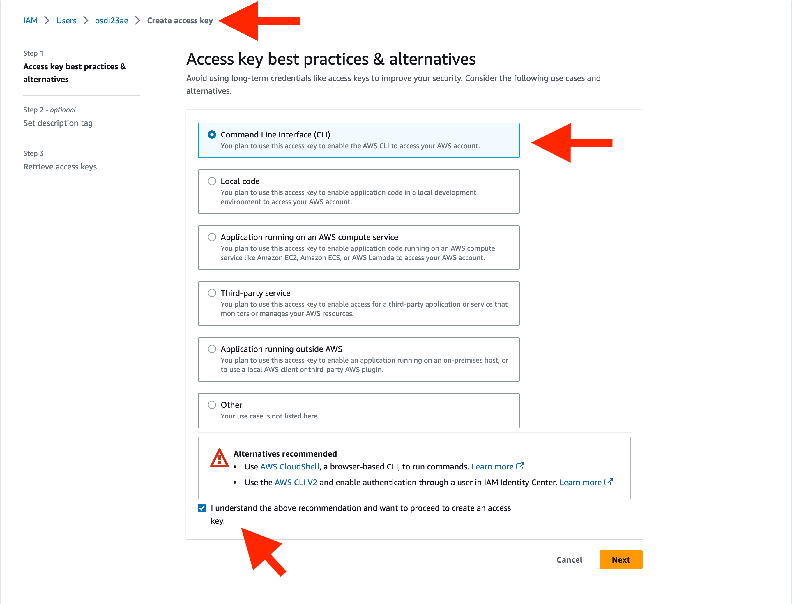
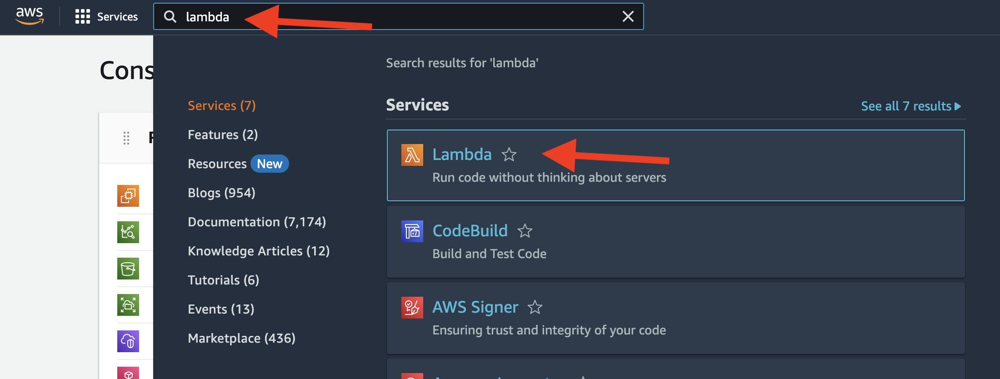
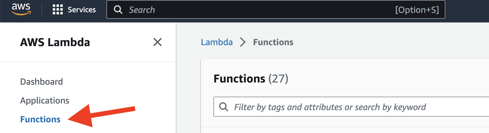
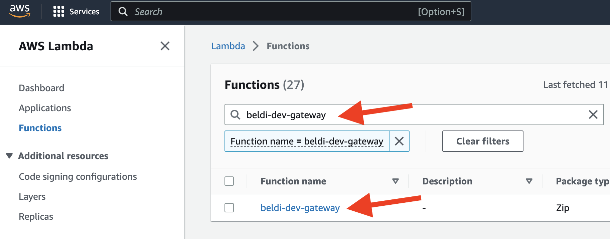
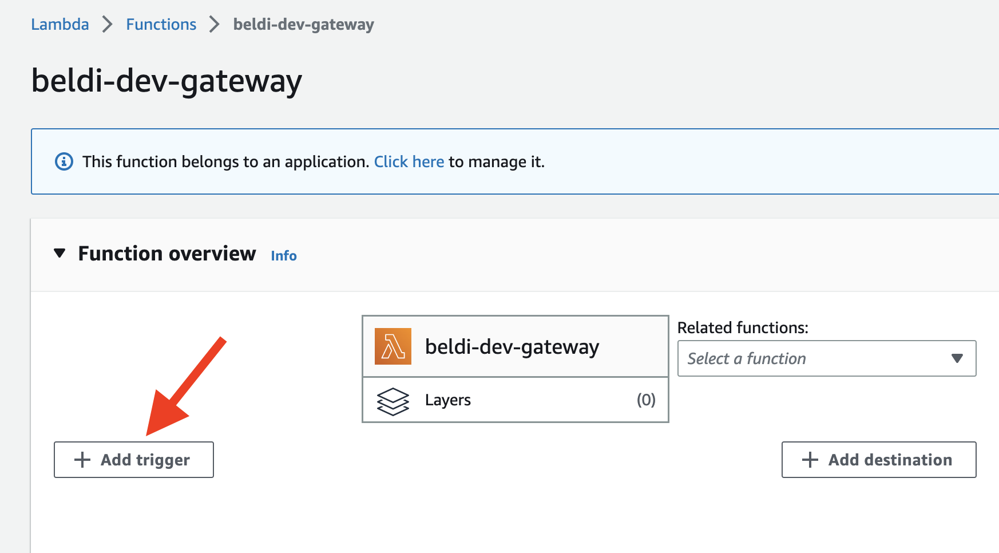
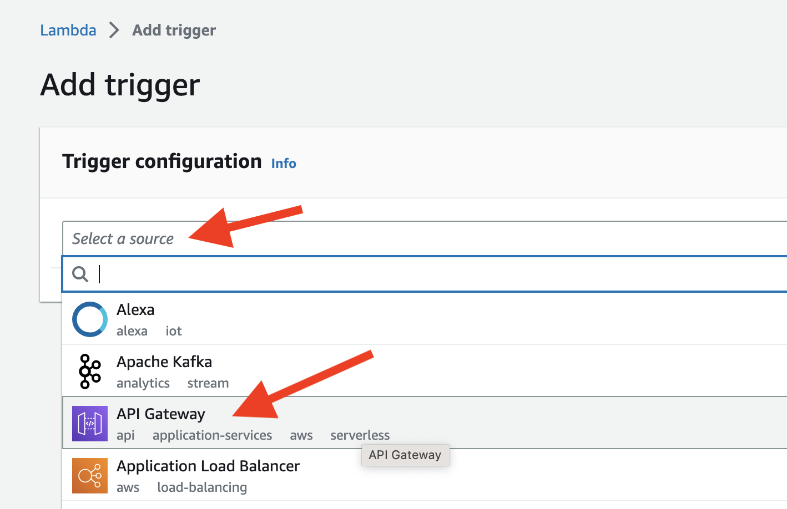
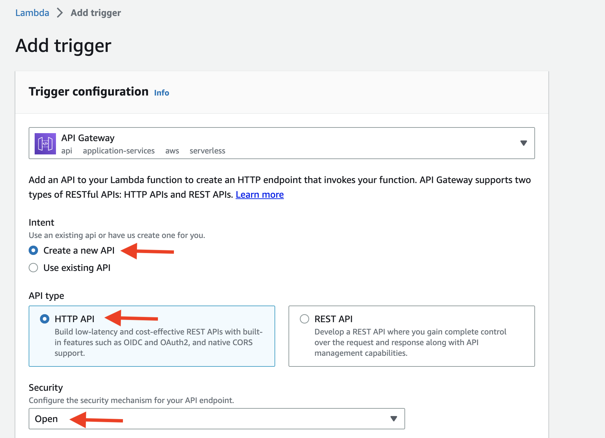
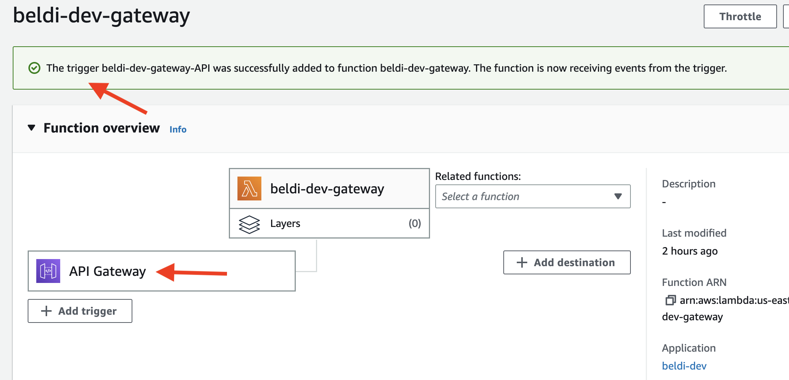

# ExoFlow: A universal workflow system for exactly-once DAGs

**OSDI'23 Artifact Evaluation**

## Overview

This guide will help you set up and run experiments for the ExoFlow paper. It is divided into three main sections: Local Setup, Main Results and Microbenchmarks.

Follow the instructions in each section to reproduce the results.

## Local Setup

### Conda Environment

The local setup is necessary to launch the clusters for the experiments. We recommend using a [Conda](https://docs.conda.io/en/latest/miniconda.html) environment for isolation. Run the following commands to create a Conda environment named `exoflow` and install all required dependencies:

```bash
conda create -n exoflow python=3.8.13
conda activate exoflow
# We install `grpcio` separately to handle Apple M1 chip issues.
conda install 'grpcio<=1.43.0' -y
pip install awscli boto3 ray==2.0.1
```

Refer to the [AWS CLI documentation](https://docs.aws.amazon.com/cli/latest/userguide/cli-configure-sso.html) for configuring the AWS CLI, so that you can launch a cluster with your AWS account later.

### Setup Remote Shared Cluster

Once your local setup is ready, launch the shared cluster by running:

```bash
ray up -y <Your Local ExoFlow Github Repository>/clusters/shared.yaml --disable-usage-stats
```

After the cluster is ready, follow the instructions on your screen to log in to the cluster.

You will then need to set up your AWS credentials on the cluster to enable automation of the experiments.

On the cluster, first, create the `.aws` directory:

```bash
mkdir -p ~/.aws
```

Next, edit the `~/.aws/credentials` file (e.g., `vim ~/.aws/credentials`) and add the following content:

```
[default]
region=us-east-1
aws_access_key_id=<Your AWS Access Key ID>
aws_secret_access_key=<Your AWS Secret Access Key>
```

If you don't know your AWS credentials, follow the instructions [here](https://docs.aws.amazon.com/powershell/latest/userguide/pstools-appendix-sign-up.html) to create or retrieve them. See the image below for guidance on creating an access key for your AWS credentials: to create or get them. See the image below for guidance on creating an access key for your AWS credentials:



Finally, secure your credentials by changing the permission of the `~/.aws/credentials` file to `600`:

```bash
chmod 600 ~/.aws/credentials
```

**IMPORTANT NOTE: For all subsequent experiments, run commands inside the shared cluster you just created. This keeps your local environment clean.**

## Main Results

This section is divided into three subsections, representing the main results of the paper: 5.1 ML training pipelines, 5.2 Stateful serverless workflows and 5.3 Online-offline graph processing.

### 5.1 ML training pipelines

To run the experiment, start the cluster by running:

```bash
ray up -y /exoflow/clusters/distributed_training_cluster.yaml
```

After the cluster is fully ready, initialize the cluster by running (in the shared cluster, not the new cluster):

```bash
/exoflow/clusters/init_s3_access.sh
```

#### Figure 6 (left)

```bash
cd /exoflow/experiments/distributed_training
./run.sh
```

#### Figure 6 (right)

```bash
cd /exoflow/experiments/distributed_training
./run.sh
```

### 5.2 Stateful serverless workflows

Before running the experiments, set up the serverless functions and the ExoFlow server.

#### Setup Serverless Functions (20-40 minutes)

First, deploy the serverless functions:

```bash
/exoflow/experiments/stateful_serverless/deploy.sh
# deploy shared Lambda functions for ExoFlow
/exoflow/experiments/stateful_serverless/deploy-exoflow.sh
```

Second, set up the gateway for Beldi by following these steps:

1. Go to the AWS console and click the Lambda. 
2. In the Lambda console, click `function`. 
3. Search for `beldi-dev-gateway` and click it. 
4. On the function page, click `add trigger` and select `API Gateway`.  
5. Configure the trigger as shown below and add it. 
6. You should see the screen as shown below after adding the trigger.  You can check the URL of the gateway by clicking the trigger on the page.
7. Run `/exoflow/experiments/stateful_serverless/get_beldi_gateway.sh`. If everything is set up correctly, it will return the same URL of the gateway as above.

#### Setup ExoFlow Server (10 minutes)

Set up the ExoFlow server to run stateful serverless workflows with ExoFlow.

In the shared cluster, run the following command to set up the ExoFlow server:

```bash
ray up -y /exoflow/clusters/stateful_serverless_exoflow_cluster.yaml --disable-usage-stats
```

After the cluster is ready, follow the instructions on your screen to log in to the ExoFlow server cluster. Then, run the following command to start the ExoFlow server:

```bash
cd /exoflow/experiments/stateful_serverless
pip install -r requirements.txt
./start_exoflow_server.sh
```

The server is ready when you see a few messages like this (it will take ~2min):

```
[2023-04-24 06:05:25 +0000] [4913] [INFO] Application startup complete.
```

It is normal for the server to print messages like:

```
(WorkflowManagementActor pid=51786) 2023-04-24 07:15:58,611     WARNING worker.py:2254 -- Using blocking ray.get inside async actor. This blocks the event loop. Please use `await` on object ref with asyncio.gather if you want to yield execution to the event loop instead.
```

#### Figure 7(a)

**Beldi**

(~75 min) Batch run all experiments with the following command:

```bash
docker exec -w /root/beldi -it beldi bash -ic "/stateful_serverless/benchmark/batch-beldi.sh"
```

(*recommanded*) Alternatively, you can run the experiments one by one with the rate (i.e., throughput) you want (7-10 min):

```bash
docker exec -w /root/beldi -it beldi bash -ic "/stateful_serverless/benchmark/benchmark-beldi.sh $rate"
```

Check Beldi results in `/exoflow/experiments/stateful_serverless/result/beldi/`

**ExoFlow**

(~75 min) Batch run all experiments with the following command:

```bash
docker exec -w /root/beldi -it beldi bash -ic "/stateful_serverless/benchmark/batch-exoflow.sh"
```

(*recommanded*) Alternatively, you can run the experiments one by one with the rate (i.e., throughput) you want (7-10 min):

```bash
docker exec -w /root/beldi -it beldi bash -ic "/stateful_serverless/benchmark/benchmark-exoflow.sh $rate"
```

Check ExoFlow results by running `python /exoflow/experiments/stateful_serverless/collect_metrics.py` and check the `workflow-server` field in `/exoflow/experiments/stateful_serverless/result/result.json`. The array in the field represents the latency under the throughput of `[100, 200, 300, 400, 500, 600, 700, 800, 900, 1000]` requests per second.

**ExoFlow-Failure**

This experiment requires an extra deployment:

```bash
/exoflow/experiments/stateful_serverless/deploy-exoflow-ft.sh
```

NOTE: This deployment overwrites the previous ExoFlow deployment. If you want to run the previous experiments, you need to redeploy the serverless functions (deploy-exoflow.sh).

(~75 min) Batch running of all experiments with the following command:

```bash
docker exec -w /root/beldi -it beldi bash -ic "/stateful_serverless/benchmark/batch-exoflow-failure.sh"
```

(*recommanded*) Alternatively, you can run the experiments one by one with the rate (i.e., throughput) you want (7-10 min):

```bash
docker exec -w /root/beldi -it beldi bash -ic "/stateful_serverless/benchmark/benchmark-exoflow-failure.sh $rate"
```

Check ExoFlow-Failure results by running `python /exoflow/experiments/stateful_serverless/collect_metrics.py` and check the `workflow-server-failure` field in `/exoflow/experiments/stateful_serverless/result/result.json`. The array in the field represents the latency under the throughput of `[100, 200, 300, 400, 500, 600, 700, 800, 900, 1000]` requests per second.

#### Figure 7(b)

(7-10 min) Beldi:

```bash
docker exec -w /root/beldi -it beldi bash -ic "/stateful_serverless/benchmark/benchmark-beldi-reserve.sh"
```

(7-10 min) "-WAL"

```bash
docker exec -w /root/beldi -it beldi bash -ic "/stateful_serverless/benchmark/benchmark-exoflow-reserve.sh reserve_serial"
```

(7-10 min) "+parallel"

```bash
docker exec -w /root/beldi -it beldi bash -ic "/stateful_serverless/benchmark/benchmark-exoflow-reserve.sh reserve"
```

(7-10 min) "+async"

```bash
docker exec -w /root/beldi -it beldi bash -ic "/stateful_serverless/benchmark/benchmark-exoflow-reserve.sh reserve_overlapckpt"
```

(7-10 min) "-async"

```bash
docker exec -w /root/beldi -it beldi bash -ic "/stateful_serverless/benchmark/benchmark-exoflow-reserve.sh reserve_nooverlapckpt"
```

Check results by running `python /exoflow/experiments/stateful_serverless/collect_metrics.py` and look into `/exoflow/experiments/stateful_serverless/result/result.json`. Here is the mapping between the field in the result JSON file and the legend in the figure:

* beldi-cloudwatch-reserve -> Beldi
* reserve_serial -> +WAL
* reserve -> +parallel
* reserve_overlapckpt -> +async
* reserve_nooverlapckpt -> -async

You could further run `python /exoflow/experiments/stateful_serverless/plot.py` to plot Figure 7(a) and 7(b). The generated figures are saved in `/exoflow/experiments/stateful_serverless/plots`.

### 5.3 Online-offline graph processing

We start with downloading the twitter dataset:

```bash
/exoflow/experiments/graph_streaming/setup_dataset.sh
```

#### Figure 7(c)

## Microbenchmark

### Figure 8(a)

### Figure 8(b)

### Figure 8(c)
