# ExoFlow: A universal workflow system for exactly-once DAGs

**OSDI'23 Artifact Evaluation**

## Overview

This guide is designed to assist you in setting up and running experiments for the ExoFlow paper. It is organized into three primary sections: Local Setup, Main Results, and Microbenchmarks.

Please follow the instructions in each section to reproduce the results.

**NOTE:** All experiments in the paper were executed in batch mode with proper warm-up. To facilitate the reviewer's reproduction of the results, we provide commands to run each experiment individually. If you encounter significant overhead due to insufficient warm-up during these individual runs, we recommend running the experiment again after the initial run for better results.

## Local Setup

### Conda Environment

The local setup is necessary to launch the clusters for the experiments. We recommend using a [Conda](https://docs.conda.io/en/latest/miniconda.html) environment for isolation. Run the following commands to create a Conda environment named `exoflow` and install all required dependencies:

```bash
conda create -n exoflow python=3.8.13
conda activate exoflow
# We install `grpcio` separately to handle Apple M1 chip issues.
conda install 'grpcio<=1.43.0' -y
pip install awscli boto3 ray==2.0.1
```

Refer to the [AWS CLI documentation](https://docs.aws.amazon.com/cli/latest/userguide/cli-configure-sso.html) for configuring the AWS CLI, so that you can launch a cluster with your AWS account later.

### Setup Remote Shared Cluster

Once your local setup is ready, launch the shared cluster by running:

```bash
ray up -y <Your Local ExoFlow Github Repository>/clusters/shared.yaml --disable-usage-stats
```

Let us call the cluster `@BASE`.

After `@BASE` is ready, follow the instructions on your screen to log in to `@BASE`. You can alreadys log in to `@BASE` from your local device by running:

```bash
ray attach <Your Local ExoFlow Github Repository>/clusters/shared.yaml
```

You will then need to set up your AWS credentials on the cluster to enable automation of the experiments.

In `@BASE`, first, create the `.aws` directory:

```bash
mkdir -p ~/.aws
```

Next, edit the `~/.aws/credentials` file (e.g., `vim ~/.aws/credentials`) and add the following content:

```
[default]
region=us-east-1
aws_access_key_id=<Your AWS Access Key ID>
aws_secret_access_key=<Your AWS Secret Access Key>
```

If you don't know your AWS credentials, follow the instructions [here](https://docs.aws.amazon.com/powershell/latest/userguide/pstools-appendix-sign-up.html) to create or retrieve them. See the image below for guidance on creating an access key for your AWS credentials: to create or get them. See the image below for guidance on creating an access key for your AWS credentials:


Finally, secure your credentials by changing the permission of the `~/.aws/credentials` file to `600`:

```bash
chmod 600 ~/.aws/credentials
```

**IMPORTANT NOTE: For all subsequent experiments, run commands inside `@BASE` by default. This keeps your local environment clean.**

## Main Results

This section is divided into three subsections, representing the main results of the paper: 5.1 ML training pipelines, 5.2 Stateful serverless workflows and 5.3 Online-offline graph processing.

### 5.1 ML training pipelines

To run the experiment, start the cluster from `@BASE` by running:

```bash
ray up -y /exoflow/clusters/distributed_training_cluster.yaml
```

Let us call the cluster `@ML`.

Wait until `@ML` is fully ready (a worker node is started later. It would usually take another 5 minutes after you can log in to the cluster).

#### Figure 6 (left)

(~12 hours) Batch run all experiments with the following command on `@ML`:

```bash
cd /exoflow/experiments/distributed_training
./run.sh
```

Alternatively, you can run the experiments individually (10-12 min each):

**Selective AsyncCkpt**

```bash
cd /exoflow/experiments/distributed_training
./restart_ray.sh
python run.py --checkpoint=hybrid --enhance-dataset-multiplier=<dataset size>
```

**NoCkpt**

```bash
cd /exoflow/experiments/distributed_training
./restart_ray.sh
python run.py --checkpoint=false --enhance-dataset-multiplier=<dataset size>
```

**AsyncCkpt**

```bash
cd /exoflow/experiments/distributed_training
./restart_ray.sh
python run.py --checkpoint=async --enhance-dataset-multiplier=<dataset size>
```

**SyncCkpt**

```bash
cd /exoflow/experiments/distributed_training
./restart_ray.sh
python run.py --checkpoint=true --enhance-dataset-multiplier=<dataset size>
```

**Workflow Tasks**

```bash
cd /exoflow/experiments/distributed_training
./restart_ray.sh
python run.py --checkpoint=false --enhance-dataset-multiplier=<dataset size> --disable-ephemeral-tasks
```

#### Figure 6 (right)

(~20 hours) Batch run all experiments with the following command on `@ML`:

```bash
cd /exoflow/experiments/distributed_training
./run_fault_tolerance.sh
```

Alternatively, you can run the experiments individually (~30 min each):

**Cluster Failure**

```bash
cd /exoflow/experiments/distributed_training
cluster_failure="train_12.cluster_crash"

# Selective AsyncCkpt
workflow_id=$(openssl rand -hex 12)
./restart_ray.sh && python run.py --checkpoint=hybrid --enhance-dataset-multiplier=4 --failure=$cluster_failure --workflow-id=$workflow_id
./restart_ray.sh && python run.py --checkpoint=hybrid --enhance-dataset-multiplier=4 --failure=$cluster_failure --workflow-id=$workflow_id --resume

# NoCkpt
workflow_id=$(openssl rand -hex 12)
./restart_ray.sh && python run.py --checkpoint=false --enhance-dataset-multiplier=4 --failure=$cluster_failure --workflow-id=$workflow_id
./restart_ray.sh && python run.py --checkpoint=false --enhance-dataset-multiplier=4 --failure=$cluster_failure --workflow-id=$workflow_id --resume

# SyncCkpt
workflow_id=$(openssl rand -hex 12)
./restart_ray.sh && python run.py --checkpoint=true --enhance-dataset-multiplier=4 --failure=$cluster_failure --workflow-id=$workflow_id
./restart_ray.sh && python run.py --checkpoint=true --enhance-dataset-multiplier=4 --failure=$cluster_failure --workflow-id=$workflow_id --resume
```

**Other Failure**

Other failure is based on this template:

```bash
cd /exoflow/experiments/distributed_training
rm *.task_crash
rm *.cluster_crash

# Selective AsyncCkpt
./restart_ray.sh && python run.py --checkpoint=hybrid --enhance-dataset-multiplier=4 --failure=<failure_trigger>
# NoCkpt
./restart_ray.sh && python run.py --checkpoint=false --enhance-dataset-multiplier=4 --failure=<failure_trigger>
# SyncCkpt
./restart_ray.sh && python run.py --checkpoint=true --enhance-dataset-multiplier=4 --failure=<failure_trigger>
```

Here are the corresponding failure triggers:

* Ingestion Data Worker Failure: `preprocess.task_crash`
* Training Actor Failure: `train_actor_8.task_crash`
* Augmentation Task Failure: `transform_8.task_crash`
* Augmentation Data Worker Failure: `transform_subtask_8.task_crash`

TODO: add plotting instructions

### 5.2 Stateful serverless workflows

Before running the experiments, set up the serverless functions and the ExoFlow server.

#### Setup Serverless Functions (20-40 minutes)

First, deploy the serverless functions (`@BASE`):

```bash
/exoflow/experiments/stateful_serverless/deploy.sh
# deploy shared Lambda functions for ExoFlow
/exoflow/experiments/stateful_serverless/deploy-exoflow.sh
```

Second, set up the gateway for Beldi by following these steps:

1. Go to the AWS console and click the Lambda. 
2. In the Lambda console, click `function`. 
3. Search for `beldi-dev-gateway` and click it. 
4. On the function page, click `add trigger` and select `API Gateway`.  
5. Configure the trigger as shown below and add it. 
6. You should see the screen as shown below after adding the trigger.  You can check the URL of the gateway by clicking the trigger on the page.
7. Run `/exoflow/experiments/stateful_serverless/get_beldi_gateway.sh`. If everything is set up correctly, it will return the same URL of the gateway as above.

#### Setup ExoFlow Server (10 minutes)

Set up the ExoFlow server to run stateful serverless workflows with ExoFlow.

In the shared cluster, run the following command to set up the ExoFlow server:

```bash
ray up -y /exoflow/clusters/stateful_serverless_exoflow_cluster.yaml --disable-usage-stats
```

We will call the cluster `@SERVER`.

After `@SERVER` is ready, follow the instructions on your screen to log in to `@SERVER`. Then, run the following command on `@SERVER` to start the ExoFlow server:

```bash
cd /exoflow/experiments/stateful_serverless
pip install -r requirements.txt
./start_exoflow_server.sh
```

The server is ready when you see a few messages like this (it will take ~2min):

```
[2023-04-24 06:05:25 +0000] [4913] [INFO] Application startup complete.
```

It is normal for the server to print messages like:

```
(WorkflowManagementActor pid=51786) 2023-04-24 07:15:58,611     WARNING worker.py:2254 -- Using blocking ray.get inside async actor. This blocks the event loop. Please use `await` on object ref with asyncio.gather if you want to yield execution to the event loop instead.
```

#### Figure 7(a)

**Beldi**

(~75 min) Batch run all experiments with the following command on `@BASE`:

```bash
docker exec -w /root/beldi -it beldi bash -ic "/stateful_serverless/benchmark/batch-beldi.sh"
```

(*recommanded*) Alternatively, you can run the experiments one by one with the rate (i.e., throughput) you want (7-10 min):

```bash
docker exec -w /root/beldi -it beldi bash -ic "/stateful_serverless/benchmark/benchmark-beldi.sh $rate"
```

Check Beldi results in `/exoflow/experiments/stateful_serverless/result/beldi/`

**ExoFlow**

(~75 min) Batch run all experiments with the following command on `@BASE`:

```bash
docker exec -w /root/beldi -it beldi bash -ic "/stateful_serverless/benchmark/batch-exoflow.sh"
```

(*recommanded*) Alternatively, you can run the experiments one by one with the rate (i.e., throughput) you want (7-10 min):

```bash
docker exec -w /root/beldi -it beldi bash -ic "/stateful_serverless/benchmark/benchmark-exoflow.sh $rate"
```

Check ExoFlow results by running `python /exoflow/experiments/stateful_serverless/collect_metrics.py` and check the `workflow-server` field in `/exoflow/experiments/stateful_serverless/result/result.json`. The array in the field represents the latency under the throughput of `[100, 200, 300, 400, 500, 600, 700, 800, 900, 1000]` requests per second.

**ExoFlow-Failure**

This experiment requires an extra deployment on `@BASE`:

```bash
/exoflow/experiments/stateful_serverless/deploy-exoflow-ft.sh
```

NOTE: This deployment overwrites the previous ExoFlow deployment. If you want to run the previous experiments, you need to redeploy the serverless functions (deploy-exoflow.sh).

(~75 min) Batch running of all experiments with the following command on `@BASE`:

```bash
docker exec -w /root/beldi -it beldi bash -ic "/stateful_serverless/benchmark/batch-exoflow-failure.sh"
```

(*recommanded*) Alternatively, you can run the experiments one by one with the rate (i.e., throughput) you want (7-10 min, on `@BASE`):

```bash
docker exec -w /root/beldi -it beldi bash -ic "/stateful_serverless/benchmark/benchmark-exoflow-failure.sh $rate"
```

Check ExoFlow-Failure results by running `python /exoflow/experiments/stateful_serverless/collect_metrics.py` and check the `workflow-server-failure` field in `/exoflow/experiments/stateful_serverless/result/result.json`. The array in the field represents the latency under the throughput of `[100, 200, 300, 400, 500, 600, 700, 800, 900, 1000]` requests per second.

#### Figure 7(b)

**Beldi**

(7-10 min) Beldi:

```bash
docker exec -w /root/beldi -it beldi bash -ic "/stateful_serverless/benchmark/benchmark-beldi-reserve.sh"
```

(~60 min) Batch run all experiments with the following command on `@BASE`:

```bash
docker exec -w /root/beldi -it beldi bash -ic "/stateful_serverless/benchmark/batch-exoflow-reserve.sh"
```

Or your can run them one by one:

(7-10 min) "-WAL"

```bash
docker exec -w /root/beldi -it beldi bash -ic "/stateful_serverless/benchmark/benchmark-exoflow-reserve.sh reserve_serial"
```

(7-10 min) "+parallel"

```bash
docker exec -w /root/beldi -it beldi bash -ic "/stateful_serverless/benchmark/benchmark-exoflow-reserve.sh reserve"
```

(7-10 min) "+async"

```bash
docker exec -w /root/beldi -it beldi bash -ic "/stateful_serverless/benchmark/benchmark-exoflow-reserve.sh reserve_overlapckpt"
```

(7-10 min) "-async"

```bash
docker exec -w /root/beldi -it beldi bash -ic "/stateful_serverless/benchmark/benchmark-exoflow-reserve.sh reserve_nooverlapckpt"
```

Check results by running `python /exoflow/experiments/stateful_serverless/collect_metrics.py` and look into `/exoflow/experiments/stateful_serverless/result/result.json`. Here is the mapping between the field in the result JSON file and the legend in the figure:

* beldi-cloudwatch-reserve -> Beldi
* reserve_serial -> +WAL
* reserve -> +parallel
* reserve_overlapckpt -> +async
* reserve_nooverlapckpt -> -async

You could further run `python /exoflow/experiments/stateful_serverless/plot.py` to plot Figure 7(a) and 7(b). The generated figures are saved in `/exoflow/experiments/stateful_serverless/plots`.

### 5.3 Online-offline graph processing

We start with downloading and preparing the twitter dataset (~25min):

```bash
/exoflow/experiments/graph_streaming/setup_dataset.sh
```

Next, start a cluster for graph processing:

```bash
ray up /exoflow/clusters/graph_streaming_cluster.yaml -y --disable-usage-stats
```

Then SSH into the cluster following the instructions from the output of the command, after the cluster is up. Then wait for about 5min for the whole cluster to be ready.


#### Figure 7(c)

Inside the graph processing cluster, first, config the Spark cluster:

```bash
/exoflow/experiments/graph_streaming/config_spark_cluster.sh
```

Then run the experiments in batch (~6 hours):

```bash
cd /exoflow/experiments/graph_streaming
./run.sh
```

You can easily the batch into 3 parts:

```bash
# ExoFlow NoCkpt
python run.py --checkpoint=false
# ExoFlow AsyncCkpt
python run.py --checkpoint=async
# ExoFlow SyncCkpt
python run.py --checkpoint=true
```

NOTE: It takes a long time for each experiment to start, due to writing the DAG to S3.

After the experiments are done, you can collect the results by running:

```bash
cd /exoflow/experiments/graph_streaming
python collect_metrics.py
```

Existing results are saved in `result/analyze_outputs`. They are array of latency per iteration.

Finally, you can plot the results by running:

```bash
cd /exoflow/experiments/graph_streaming
python plot.py
```

The generated figures are saved in `plots`.

## 5.4 Microbenchmark

For the microbenchmarks, you need to setup the infrastructure for these baselines:

1. AWS Managed Apache Airflow
2. AWS Standard Step Functions
3. AWS Express Step Functions
4. A cluster (besides the shared cluster) for running the microbenchmarks

Here are the instructions:

### Setup AWS Managed Apache Airflow

(~40min to setup)

Before setting up Airflow, we need to provide requirements.txt for the DAGs, as well as uploading DAGs. We provde a script for you (run them on the shared cluster):

```bash
cd /exoflow/experiments/microbenchmarks/latency/dags
# upload requirements.txt & related DAGs
bash upload_dag.sh
```

Next, setup `Managed Apache Airflow` on AWS.

1. Go to the AWS console and select `Managed Apache Airflow`. 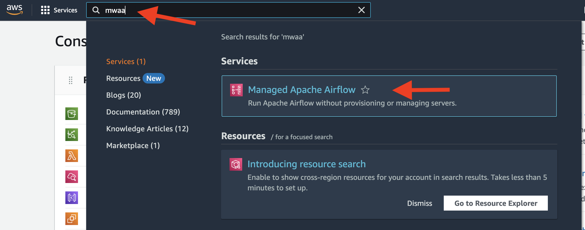
2. Click `Create environment`. 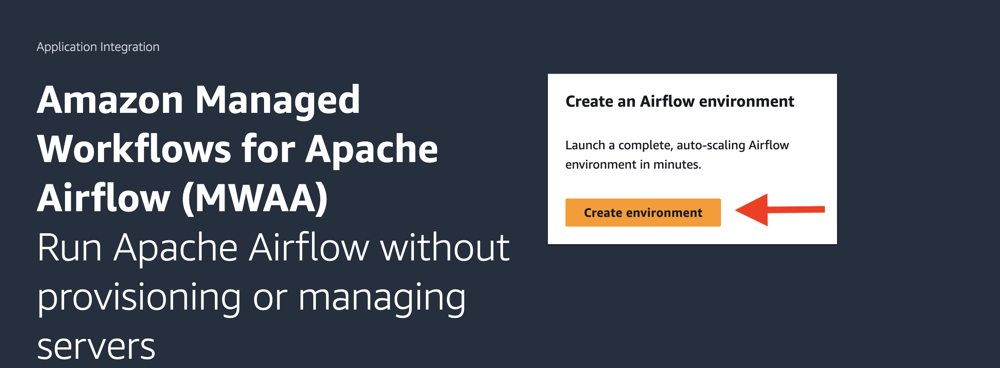
3. Config AirFlow like this: 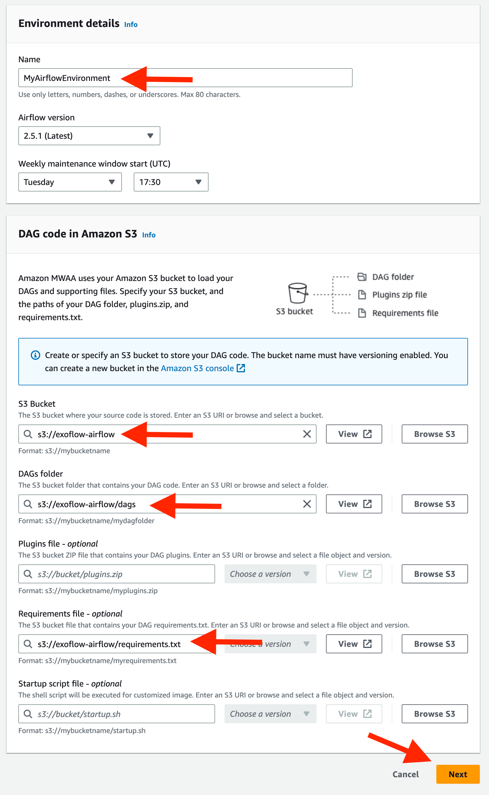 Then click `Next`.
4. Config the network. Click `Create MWAA VPC` and follow all instructions: 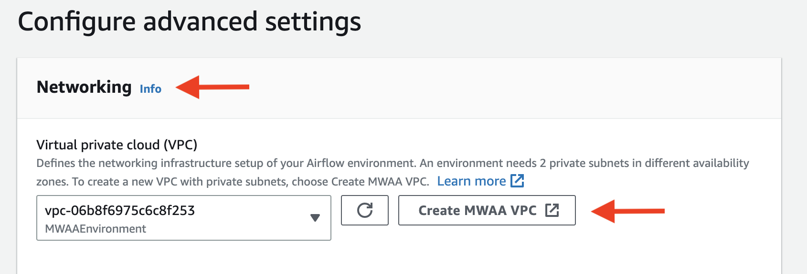 It will redirect you to `CloudFormation`, where you should wait for the stack to be created. 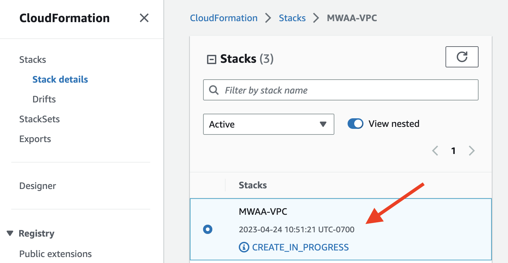 Once the creation is done, go back to the previous page and click `Refresh`. Then select the VPC you just created. 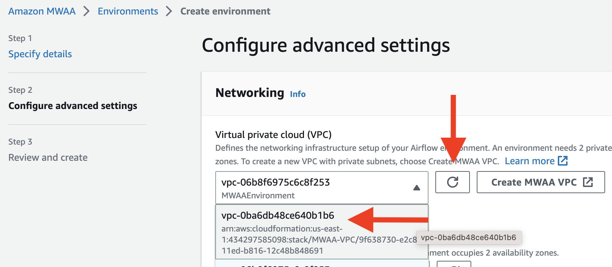 After picking the VPC, choose two subnets in the VPC. 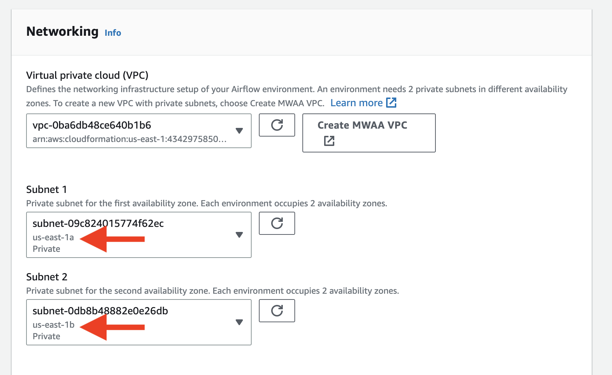 Also make sure you select the public network for the UI, otherwise you cannot open the Airflow UI directly 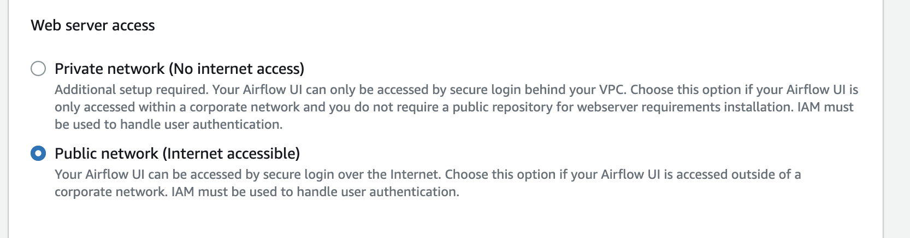
5. On the same page, select the environment class as `mw1.medium`. 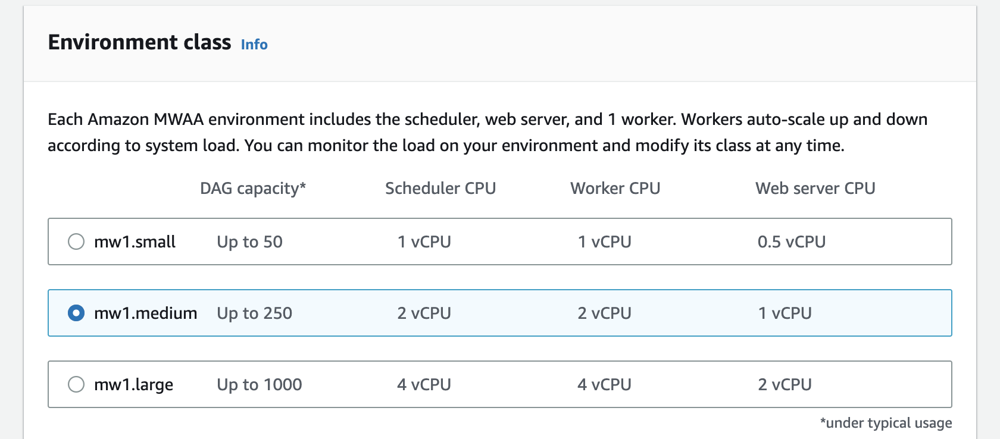 The environment class does not affect the result of our experiment significantly.
6. On the same page, config the Airflow options like this: 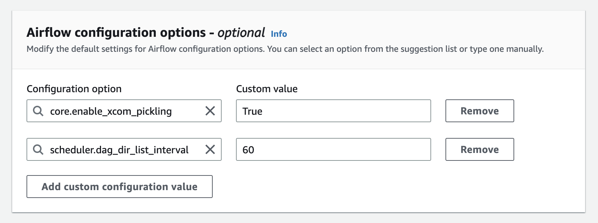 This is important for experiments to be running properly. Then click `Next`.
7. On the `Review and create` page, double check your configuration. Then click `Create environment`.
8. Wait for the environment to be ready. It would take you 20-30min. 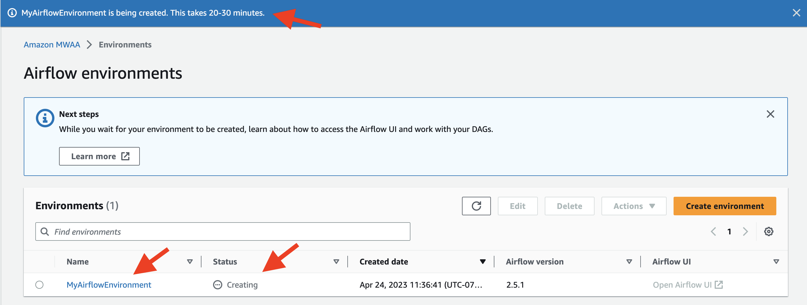
9. Once the environment is ready, go to the `Airflow UI` by clicking the link in the `Airflow webserver URL` field. The setup is successful if you can see something like this 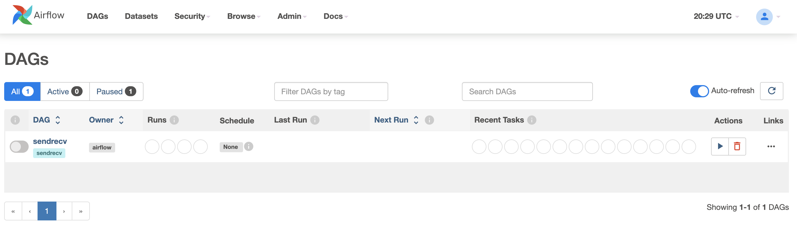. Wait for 3-5min if the DAG does not appear initially.


### Setup AWS Standard Step Functions

(~15min to setup)

First, we need to deploy serverless functions similar to the Beldi experiments (5.2). We can reuse some functionality of 5.2. Assuming you have pulled the docker of Beldi, you can run the following commands on the shared cluster:

```bash
docker exec -w /microbenchmarks/latency/lambdas -it beldi bash -ic "sls deploy -c deploy.yml"
```

1. Go to the AWS console and select `Step Functions`. 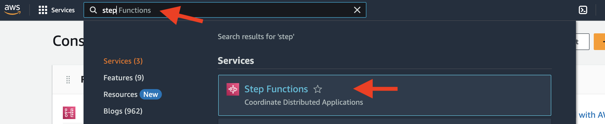
2. Toggle the left panel, choose "State machines". 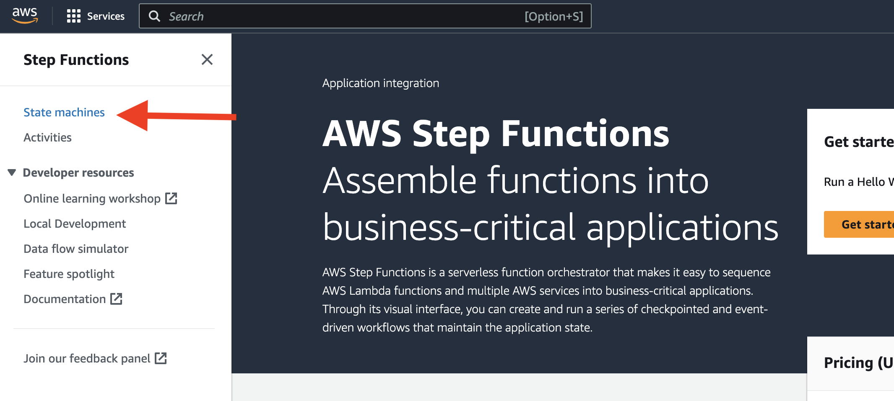
3. Click `Create state machine`. 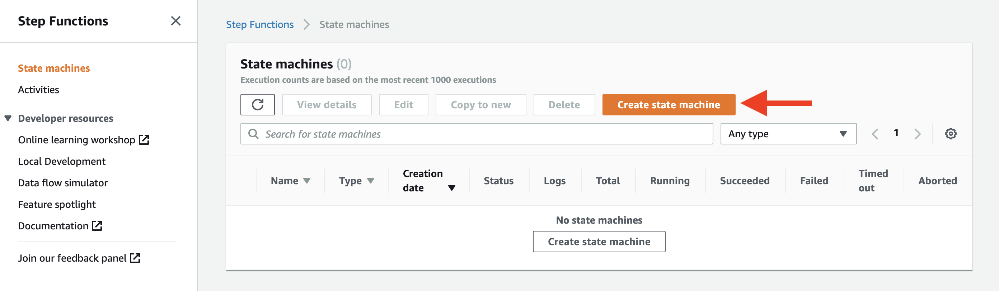
4. Config like this (select "Standard Type") 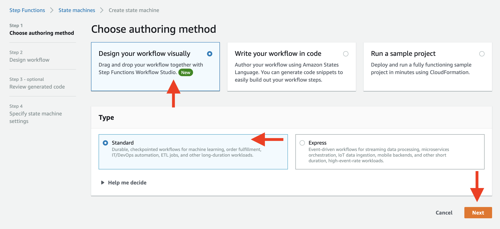 Then click `Next`.
5. Config the state machine like this 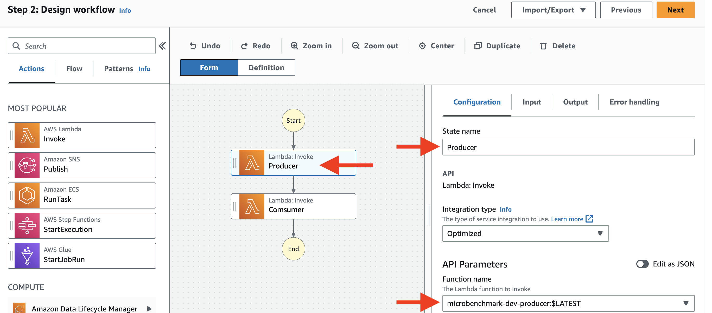 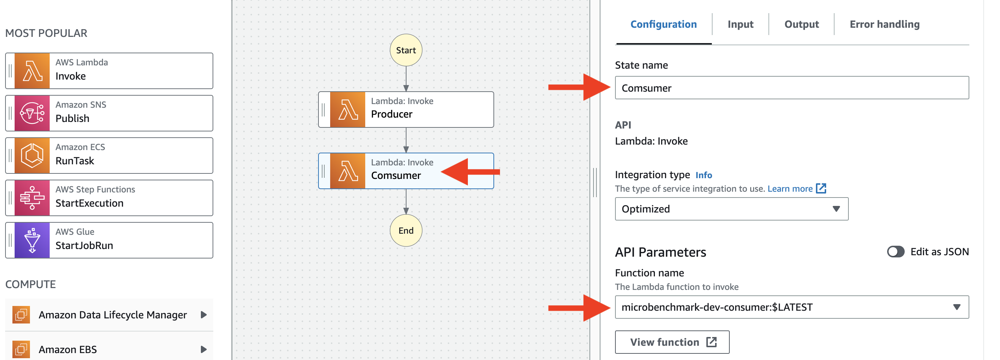 Then click `Next`.
6. On the "Specify state machine settings" page, set the name of the state machine to "SendRecvStateMachineStandard" 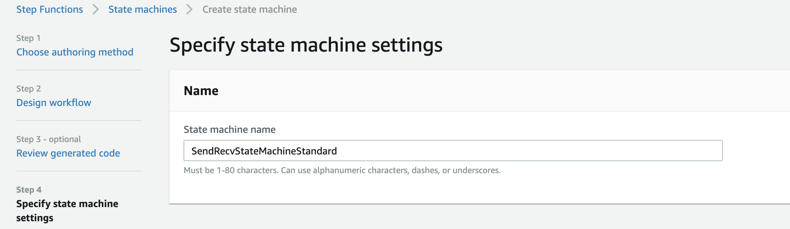
7. Click `Create state machine`. The state machine is created. Check whether the state machine exists on the state machine page. 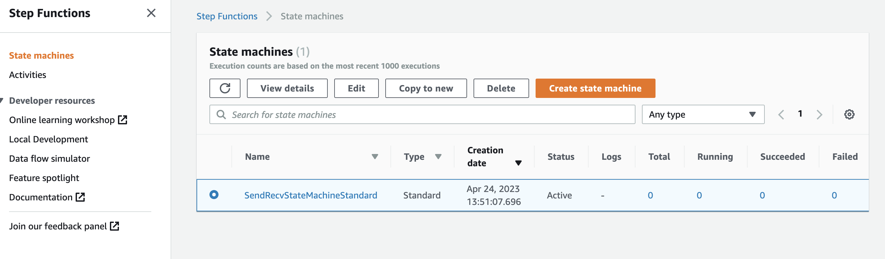


### Setup AWS Express Step Functions

(~15min to setup)

The setup is almost the same as Standard Step Functions. The only difference is that you need to select "Express Type" in step 4; and use the name "SendRecvStateMachine" in step 6.

This is what the state machine looks like after both are created:

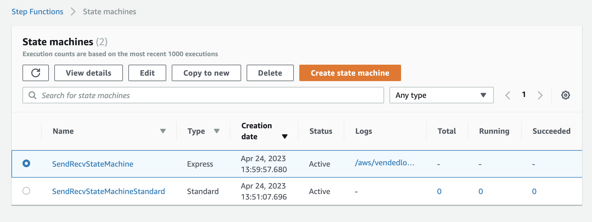


### Setup a cluster for running the microbenchmarks

(~10min to setup)

Launch the cluster for running the microbenchmarks:

```bash
ray up /exoflow/clusters/microbenchmarks_cluster.yaml -y --disable-usage-stats
```

Let's refer to this cluster as `@MICRO`. You can log into `@MICRO` (from `@BASE`) by running:

```bash
ray attach /exoflow/clusters/microbenchmarks_cluster.yaml
```

### Figure 8(a)

**Setup** Log into `@MICRO` from `@BASE`. Then run the following commands:

```bash
cd /exoflow/experiments/microbenchmarks/latency
./start_server.sh
```

Wait util the server is ready with this message:

```
INFO:     Application startup complete.
INFO:     Uvicorn running on http://0.0.0.0:8080 (Press CTRL+C to quit)
```

Turn on the Airflow DAG `sendrecv` with the Airflow UI. Here is what the webpage looks like: 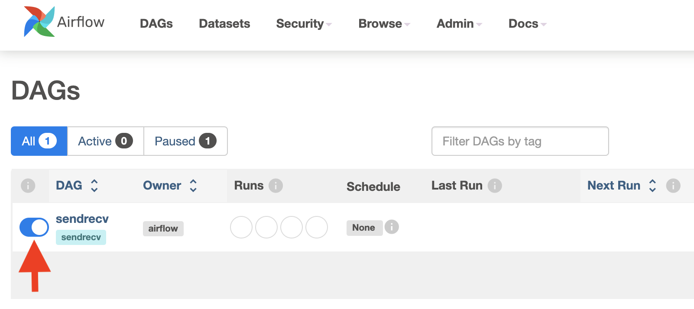

**Benchmark**

Run the following commands on `@BASE` (~6 min):

```bash
pip install shortuuid
cd /exoflow/experiments/microbenchmarks/latency/
./benchmark.sh
```

Plot the result:

```bash
cd /exoflow/experiments/microbenchmarks/latency/
python plot.py
```

The output figure (`microbenchmark-data-movement.png`) is in the `plots/` directory.

### Figure 8(b)

**Setup**

On `@BASE`, run the following commands to setup Airflow operators for Spark:

```bash
pip install jinja2
cd /exoflow/experiments/microbenchmarks/data_sharing/dags
bash upload_dag.sh
```

Wait for ~3min. Then turn on all Airflow DAG `spark` with the Airflow UI. Here is what the webpage looks like after turning all of them on: 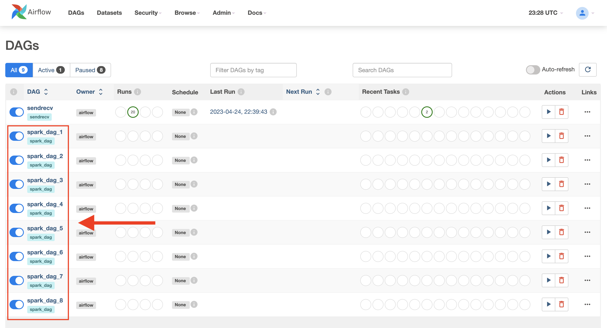


On `@MICRO`, run the following commands to config Spark:

```bash
/exoflow/experiments/microbenchmarks/data_sharing/config_spark.sh
```

Then run the following commands to start the Spark server that is called Airflow:

```bash
/exoflow/experiments/microbenchmarks/data_sharing/airflow_server.py
```

Keep this server running until the end of the experiment. For example, you can run it in a tmux session on `@MICRO`.

**Benchmark**

On `@MICRO`, run the following commands for benchmarking (~2 hour):

```bash
cd /exoflow/experiments/microbenchmarks/data_sharing
./benchmark.sh
```

Plot the result:

```bash
cd /exoflow/experiments/microbenchmarks/data_sharing
python plot.py
```

The output figure (`microbenchmark-data-shared.png`) is in the `plots/` directory.

### Figure 8(c)

