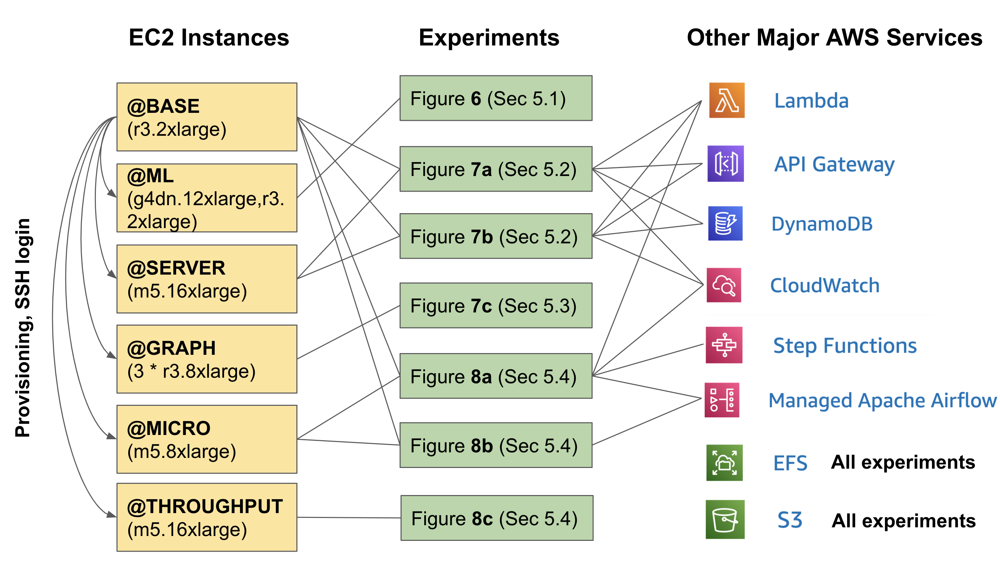

# ExoFlow: A universal workflow system for exactly-once DAGs

**OSDI'23 Artifact Evaluation**

## Abstract

This guide is designed to assist you in setting up and running experiments for the ExoFlow paper. It is organized into three primary sections: Local Setup, Main Results, and Microbenchmarks.

Please follow the instructions in each section to reproduce the results.

**NOTE:** All experiments in the paper were executed in batch mode with proper warm-up. To facilitate the reviewer's reproduction of the results, we provide commands to run each experiment individually. If you encounter significant overhead due to insufficient warm-up during these individual runs, we recommend running the experiment again after the initial run for better results.

## Overview

Our artifact operates on Amazon AWS. Below is a summary of the key AWS resources utilized in the artifact for each experiment, which you can refer to when you are running the experiments:



We understand that the graph above may seem intimidating, particularly for evaluators who are not very familiar with AWS. This is primarily due to the fact that our paper encompasses a wide variety of experiments, and we must use different baselines and setups for each experiment since the baselines might not be as versatile as ExoFlow. Additionally, we aim to include more systems for comparison.

However, there is no need to worry because (1) we have prepared most of the resources for you, and we will provide instructions for logging into our instance to run all experiments with significantly fewer steps, and (2) if you **truly wish to build and test everything from the ground up**, we also offer a [document](README-full.md) that guides you through the setup process step by step.

## Local Setup

Obtain the SSH key and configuration for the artifact by utilizing the **password** supplied in the OSDI'23 artifact submission form. The SSH key is required for accessing `@BASE`. Decrypt the SSH key and configuration by extracting the contents of the `osdi23ae_access.zip` file, located in the artifact's root directory. It is essential to set the permission for the SSH private key file (`osdi23ae`) to `600`; otherwise, the SSH connection may fail.

Here are all the components you need to setup or care about:


The majority of our resources are EC2 instances, and we ask evaluators to set them up to minimize costs. The setup commands are simple one-liners.

**IMPORTANT NOTES**
1. We trust our evaluators and grant them extensive permissions to streamline the evaluation process. However, please refrain from using or modifying our cloud resources in ways unrelated to artifact evaluation.
2. Our experiments are not designed for multi-tenancy. We kindly request that evaluators coordinate with each other and avoid running multiple experiments simultaneously. This could cause disruptions to the environment or impact the timing of the experiments.
3. After completing the evaluation, please terminate all EC2 instances other than `@BASE` using the command `ray down <the corresponding YAML file>`.
4. By default, execute all subsequent experiment commands within `@BASE`. This helps maintain a clean local environment.

## Main Results

This section is divided into three subsections, representing the main results of the paper: 5.1 ML training pipelines, 5.2 Stateful serverless workflows and 5.3 Online-offline graph processing.

### 5.1 ML training pipelines

To run the experiment, start the cluster from `@BASE` by running:

```bash
ray up -y /exoflow/clusters/distributed_training_cluster.yaml
```

Let us call the cluster `@ML`.

Wait until `@ML` is fully ready (a worker node is started later. It would usually take another 5 minutes after you can log in to the cluster).

#### Figure 6 (left)

(~12 hours) Batch run all experiments with the following command on `@ML`:

```bash
cd /exoflow/experiments/distributed_training
./run.sh
```

Alternatively, you can run the experiments individually (10-12 min each):

**Selective AsyncCkpt**

```bash
cd /exoflow/experiments/distributed_training
./restart_ray.sh
python run.py --checkpoint=hybrid --enhance-dataset-multiplier=<dataset size>
```

**NoCkpt**

```bash
cd /exoflow/experiments/distributed_training
./restart_ray.sh
python run.py --checkpoint=false --enhance-dataset-multiplier=<dataset size>
```

**AsyncCkpt**

```bash
cd /exoflow/experiments/distributed_training
./restart_ray.sh
python run.py --checkpoint=async --enhance-dataset-multiplier=<dataset size>
```

**SyncCkpt**

```bash
cd /exoflow/experiments/distributed_training
./restart_ray.sh
python run.py --checkpoint=true --enhance-dataset-multiplier=<dataset size>
```

**Workflow Tasks**

```bash
cd /exoflow/experiments/distributed_training
./restart_ray.sh
python run.py --checkpoint=false --enhance-dataset-multiplier=<dataset size> --disable-ephemeral-tasks
```

#### Figure 6 (right)

(~20 hours) Batch run all experiments with the following command on `@ML`:

```bash
cd /exoflow/experiments/distributed_training
./run_fault_tolerance.sh
```

Alternatively, you can run the experiments individually (~30 min each):

**Cluster Failure**

```bash
cd /exoflow/experiments/distributed_training
cluster_failure="train_12.cluster_crash"

# Selective AsyncCkpt
workflow_id=$(openssl rand -hex 12)
./restart_ray.sh && python run.py --checkpoint=hybrid --enhance-dataset-multiplier=4 --failure=$cluster_failure --workflow-id=$workflow_id
./restart_ray.sh && python run.py --checkpoint=hybrid --enhance-dataset-multiplier=4 --failure=$cluster_failure --workflow-id=$workflow_id --resume

# NoCkpt
workflow_id=$(openssl rand -hex 12)
./restart_ray.sh && python run.py --checkpoint=false --enhance-dataset-multiplier=4 --failure=$cluster_failure --workflow-id=$workflow_id
./restart_ray.sh && python run.py --checkpoint=false --enhance-dataset-multiplier=4 --failure=$cluster_failure --workflow-id=$workflow_id --resume

# SyncCkpt
workflow_id=$(openssl rand -hex 12)
./restart_ray.sh && python run.py --checkpoint=true --enhance-dataset-multiplier=4 --failure=$cluster_failure --workflow-id=$workflow_id
./restart_ray.sh && python run.py --checkpoint=true --enhance-dataset-multiplier=4 --failure=$cluster_failure --workflow-id=$workflow_id --resume
```

**Other Failure**

Other failure is based on this template:

```bash
cd /exoflow/experiments/distributed_training
rm *.task_crash
rm *.cluster_crash

# Selective AsyncCkpt
./restart_ray.sh && python run.py --checkpoint=hybrid --enhance-dataset-multiplier=4 --failure=<failure_trigger>
# NoCkpt
./restart_ray.sh && python run.py --checkpoint=false --enhance-dataset-multiplier=4 --failure=<failure_trigger>
# SyncCkpt
./restart_ray.sh && python run.py --checkpoint=true --enhance-dataset-multiplier=4 --failure=<failure_trigger>
```

Here are the corresponding failure triggers:

* Ingestion Data Worker Failure: `preprocess.task_crash`
* Training Actor Failure: `train_actor_8.task_crash`
* Augmentation Task Failure: `transform_8.task_crash`
* Augmentation Data Worker Failure: `transform_subtask_8.task_crash`

#### Check Results

The results for figure 6 are stored in `/exoflow/experiments/distributed_training/results`. They are quiet self-explanatory, where each row represents the running time of one experiment with corresponding configuration. To plot the results, run:

```bash
cd /exoflow/experiments/distributed_training
python plot.py
```

The plots are stored in `/exoflow/experiments/distributed_training/plots`.

### 5.2 Stateful serverless workflows

Before running the experiments, set up the serverless functions and the ExoFlow server.

#### Setup Serverless Functions (20-40 minutes)

Deploy the serverless functions (`@BASE`):

```bash
# deploy shared Lambda functions for ExoFlow
/exoflow/experiments/stateful_serverless/deploy-exoflow.sh
```

#### Setup ExoFlow Server (10 minutes)

Set up the ExoFlow server to run stateful serverless workflows with ExoFlow.

In the shared cluster, run the following command to set up the ExoFlow server:

```bash
ray up -y /exoflow/clusters/stateful_serverless_exoflow_cluster.yaml --disable-usage-stats
```

We will call the cluster `@SERVER`.

After `@SERVER` is ready, follow the instructions on your screen to log in to `@SERVER`. Then, run the following command on `@SERVER` to start the ExoFlow server:

```bash
cd /exoflow/experiments/stateful_serverless
pip install -r requirements.txt
./start_exoflow_server.sh
```

The server is ready when you see a few messages like this (it will take ~2min):

```
[2023-04-24 06:05:25 +0000] [4913] [INFO] Application startup complete.
```

It is normal for the server to print messages like:

```
(WorkflowManagementActor pid=51786) 2023-04-24 07:15:58,611     WARNING worker.py:2254 -- Using blocking ray.get inside async actor. This blocks the event loop. Please use `await` on object ref with asyncio.gather if you want to yield execution to the event loop instead.
```

#### Figure 7(a)

**Beldi**

(~75 min) Batch run all experiments with the following command on `@BASE`:

```bash
docker exec -w /root/beldi -it beldi bash -ic "/stateful_serverless/benchmark/batch-beldi.sh"
```

(*recommanded*) Alternatively, you can run the experiments one by one with the rate (i.e., throughput) you want (7-10 min):

```bash
docker exec -w /root/beldi -it beldi bash -ic "/stateful_serverless/benchmark/benchmark-beldi.sh $rate"
```

Check Beldi results in `/exoflow/experiments/stateful_serverless/result/beldi/`

**ExoFlow**

(~75 min) Batch run all experiments with the following command on `@BASE`:

```bash
docker exec -w /root/beldi -it beldi bash -ic "/stateful_serverless/benchmark/batch-exoflow.sh"
```

(*recommanded*) Alternatively, you can run the experiments one by one with the rate (i.e., throughput) you want (7-10 min):

```bash
docker exec -w /root/beldi -it beldi bash -ic "/stateful_serverless/benchmark/benchmark-exoflow.sh $rate"
```

Check ExoFlow results by running `python /exoflow/experiments/stateful_serverless/collect_metrics.py` and check the `workflow-server` field in `/exoflow/experiments/stateful_serverless/result/result.json`. The array in the field represents the latency under the throughput of `[100, 200, 300, 400, 500, 600, 700, 800, 900, 1000]` requests per second.

**ExoFlow-Failure**

This experiment requires an extra deployment on `@BASE`:

```bash
/exoflow/experiments/stateful_serverless/deploy-exoflow-ft.sh
```

NOTE: This deployment overwrites the previous ExoFlow deployment. If you want to run the previous experiments, you need to redeploy the serverless functions (deploy-exoflow.sh).

(~75 min) Batch running of all experiments with the following command on `@BASE`:

```bash
docker exec -w /root/beldi -it beldi bash -ic "/stateful_serverless/benchmark/batch-exoflow-failure.sh"
```

(*recommanded*) Alternatively, you can run the experiments one by one with the rate (i.e., throughput) you want (7-10 min, on `@BASE`):

```bash
docker exec -w /root/beldi -it beldi bash -ic "/stateful_serverless/benchmark/benchmark-exoflow-failure.sh $rate"
```

Check ExoFlow-Failure results by running `python /exoflow/experiments/stateful_serverless/collect_metrics.py` and check the `workflow-server-failure` field in `/exoflow/experiments/stateful_serverless/result/result.json`. The array in the field represents the latency under the throughput of `[100, 200, 300, 400, 500, 600, 700, 800, 900, 1000]` requests per second.

#### Figure 7(b)

**Beldi**

(7-10 min) Beldi:

```bash
docker exec -w /root/beldi -it beldi bash -ic "/stateful_serverless/benchmark/benchmark-beldi-reserve.sh"
```

(~60 min) Batch run all experiments with the following command on `@BASE`:

```bash
docker exec -w /root/beldi -it beldi bash -ic "/stateful_serverless/benchmark/batch-exoflow-reserve.sh"
```

Or your can run them one by one:

(7-10 min) "-WAL"

```bash
docker exec -w /root/beldi -it beldi bash -ic "/stateful_serverless/benchmark/benchmark-exoflow-reserve.sh reserve_serial"
```

(7-10 min) "+parallel"

```bash
docker exec -w /root/beldi -it beldi bash -ic "/stateful_serverless/benchmark/benchmark-exoflow-reserve.sh reserve"
```

(7-10 min) "+async"

```bash
docker exec -w /root/beldi -it beldi bash -ic "/stateful_serverless/benchmark/benchmark-exoflow-reserve.sh reserve_overlapckpt"
```

(7-10 min) "-async"

```bash
docker exec -w /root/beldi -it beldi bash -ic "/stateful_serverless/benchmark/benchmark-exoflow-reserve.sh reserve_nooverlapckpt"
```

Check results by running `python /exoflow/experiments/stateful_serverless/collect_metrics.py` and look into `/exoflow/experiments/stateful_serverless/result/result.json`. Here is the mapping between the field in the result JSON file and the legend in the figure:

* beldi-cloudwatch-reserve -> Beldi
* reserve_serial -> +WAL
* reserve -> +parallel
* reserve_overlapckpt -> +async
* reserve_nooverlapckpt -> -async

You could further run `python /exoflow/experiments/stateful_serverless/plot.py` to plot Figure 7(a) and 7(b). The generated figures are saved in `/exoflow/experiments/stateful_serverless/plots`.

### 5.3 Online-offline graph processing

Start a cluster for graph processing:

```bash
ray up /exoflow/clusters/graph_streaming_cluster.yaml -y --disable-usage-stats
```

Let's call the cluster `@GRAPH`.

Then SSH into `@GRAPH` following the instructions from the output of the command, after the cluster is up. Then wait for about 5min for the whole cluster to be ready.


#### Figure 7(c)

On `@GRAPH`, first, config the Spark cluster:

```bash
/exoflow/experiments/graph_streaming/config_spark_cluster.sh
```

Then run the experiments on `@GRAPH` in batch (~6 hours):

```bash
cd /exoflow/experiments/graph_streaming
./run.sh
```

You can easily split the batch into 3 parts (1.5-2.5 hours each):

```bash
# ExoFlow NoCkpt
python run.py --checkpoint=false
# ExoFlow AsyncCkpt
python run.py --checkpoint=async
# ExoFlow SyncCkpt
python run.py --checkpoint=true
```

NOTE: It takes a long time for each experiment to start, due to writing the DAG to S3.

After the experiments are done, you can collect the results by running:

```bash
cd /exoflow/experiments/graph_streaming
python collect_metrics.py
```

Existing results are saved in `result/analyze_outputs`. They are array of latency per iteration.

Finally, you can plot the results by running:

```bash
cd /exoflow/experiments/graph_streaming
python plot.py
```

The generated figures are saved in `plots`.

## 5.4 Microbenchmark

(~10min to setup)

For the microbenchmarks, you need to setup a cluster (besides `@BASE`) for running the microbenchmarks.

```bash
ray up /exoflow/clusters/microbenchmarks_cluster.yaml -y --disable-usage-stats
```

Let's refer to this cluster as `@MICRO`. You can log into `@MICRO` (from `@BASE`) by running:

```bash
ray attach /exoflow/clusters/microbenchmarks_cluster.yaml
```

### Figure 8(a)

**Setup** Log into `@MICRO` from `@BASE`. Then run the following commands:

```bash
cd /exoflow/experiments/microbenchmarks/latency
./start_server.sh
```

Wait util the server is ready with this message:

```
INFO:     Application startup complete.
INFO:     Uvicorn running on http://0.0.0.0:8080 (Press CTRL+C to quit)
```

Turn on the Airflow DAG `sendrecv` with the Airflow UI. Here is what the webpage looks like: 

**Benchmark**

Run the following commands on `@BASE` (~6 min):

```bash
pip install shortuuid
cd /exoflow/experiments/microbenchmarks/latency/
./benchmark.sh
```

Plot the result:

```bash
cd /exoflow/experiments/microbenchmarks/latency/
python plot.py
```

The output figure (`microbenchmark-data-movement.png`) is in the `plots/` directory.

### Figure 8(b)

**Setup**

On `@MICRO`, run the following commands to config Spark:

```bash
/exoflow/experiments/microbenchmarks/data_sharing/config_spark.sh
```

Then run the following commands to start the Spark server that is called by Airflow:

```bash
/exoflow/experiments/microbenchmarks/data_sharing/airflow_server.py
```

Keep this server running until the end of the experiment. For example, you can run it in a tmux session on `@MICRO`.

**Benchmark**

On `@MICRO`, run the following commands for benchmarking (~2 hour):

```bash
cd /exoflow/experiments/microbenchmarks/data_sharing
./benchmark.sh
```

Plot the result:

```bash
cd /exoflow/experiments/microbenchmarks/data_sharing
python plot.py
```

The output figure (`microbenchmark-data-shared.png`) is in the `plots/` directory.

### Figure 8(c)

On `@BASE`, launch the cluster:

```bash
ray up /exoflow/clusters/microbenchmarks-throughput-cluster.yaml -y
```

Let's refer to this cluster as `@THROUGHPUT`.

On `@THROUGHPUT`, start the benchmark:

```bash
pip install shortuuid
cd /exoflow/experiments/microbenchmarks/throughput
./benchmark.sh
```

Plot the result:

```bash
cd /exoflow/experiments/microbenchmarks/throughput
python plot.py
```

The output figure (`microbenchmark-throughput.png`) is in the `plots/` directory.
